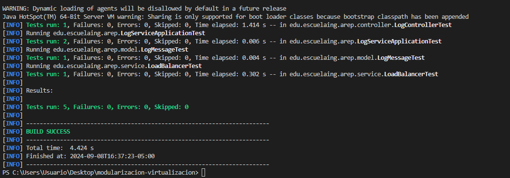
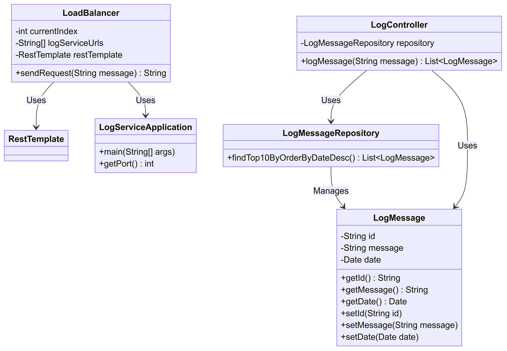
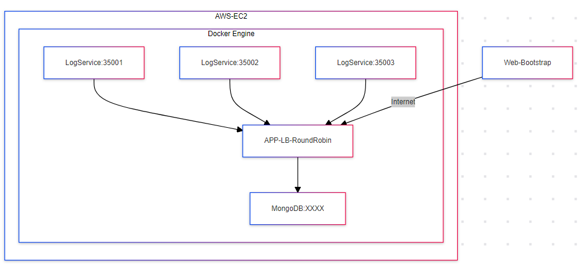
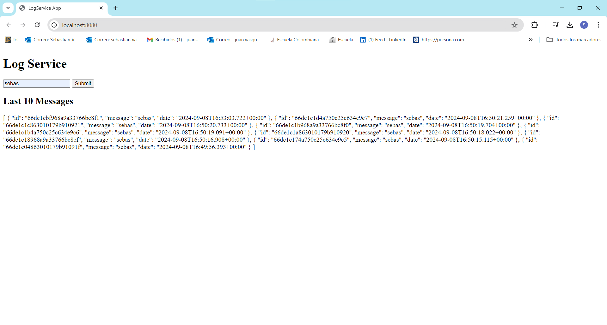

# Log Service Application

This repository contains a simple distributed log service application implemented in Java, using Spring Boot. The system is designed to handle multiple log messages through a load balancer, distributing the requests to multiple instances of log services using a round-robin algorithm. The project also includes a repository for storing and retrieving log messages and is built to handle HTTP POST requests for logging.

### Key Features
- **Round-Robin Load Balancer**: The system distributes log messages to multiple log service instances in a round-robin fashion, ensuring equal load distribution.
- **Log Service**: The service stores log messages in a MongoDB database and retrieves the 10 most recent log entries, ordered by date.
- **Custom Annotations with Spring Boot**: The application utilizes Spring Boot annotations such as `@RestController` and `@PostMapping` to define RESTful endpoints for handling HTTP requests.

### Project Overview
- **Load Balancer**: The `LoadBalancer` class distributes log messages across multiple log service instances, ensuring equal load distribution among services.
- **Log Service**: The `LogController` class exposes a `/logservice/log` endpoint to store log messages. Messages are timestamped with the Bogotá time zone and saved in a MongoDB database.
- **Persistence Layer**: The log messages are stored using MongoDB, with a repository (`LogMessageRepository`) handling the database operations.
- **Multithreading Support**: The load balancer ensures that the log messages are distributed concurrently to multiple service instances.

## Getting Started

Download the project from [the repository.](https://github.com/your-repo-link)

### Prerequisites

* [Maven](https://maven.apache.org/): Automate and standardize the lifecycle of software construction.
* [Git](https://www.git-scm.com/): Decentralized Configuration Manager.
* [MongoDB](https://www.mongodb.com/): NoSQL database used for storing log messages.

### Installing

1. **Maven**
    * Download Maven at http://maven.apache.org/download.html.
    * You need to have Java installed (Java 17 or later recommended).
    * Follow the instructions at http://maven.apache.org/download.html#Installation.

2. **Git**
    * Download Git at https://git-scm.com/download/win.
    * Follow the instructions at https://git-scm.com/book/en/v2/Getting-Started-Installing-Git.

3. **MongoDB**
    * Install and run MongoDB. You can download it from https://www.mongodb.com/try/download/community.

### Running the Application

1. Clone the repository:
    ```bash
    git clone https://github.com/Sebasvasquezz/Taller-de-modularizacion-con-virtualizacion-e-Introduccion-a-Docker

    cd your-repo-directory
    ```

2. Build the project with Maven:
    ```bash
    mvn package
    ```

3. Run the application:
    ```bash
    docker-compose up -d
    ```

Alternatively, you can run the application directly using Java:
```bash
& 'C:\Program Files\Java\jdk-17\bin\java.exe' -cp 'target/classes' 'edu.escuelaing.arep.LogServiceApplication'
```

## Running the Tests

Once the repository is downloaded, open a command prompt and run the following command to run the unit tests:

```
mvn test
```


The execution:



## Design

### Class Diagram
The class diagram below represents the structure and relationships of the *LogService* project:



### Class Diagram Explanation

The following class diagram illustrates the architecture of the Log Service Application project, highlighting the key components, their relationships, and responsibilities.

### Components and Relationships

- **LogServiceApplication**: This is the entry point of the application, responsible for configuring the port and starting the Spring Boot server.
  
- **LogController**: This class handles HTTP POST requests to log messages. It receives log messages, assigns timestamps, and stores them in the repository.

- **LoadBalancer**: Responsible for distributing log requests across multiple instances of the log service using a round-robin algorithm. It communicates with the log services through the `RestTemplate`.

- **LogMessageRepository**: Manages the persistence of `LogMessage` objects. It interacts with MongoDB to save and retrieve log messages, including fetching the 10 most recent logs.

- **LogMessage**: Represents an individual log entry, containing an `id`, the `message` string, and the `date` of creation.

### Diagram Summary

- **LogController → LogMessageRepository**: The `LogController` interacts with the `LogMessageRepository` to save and retrieve log entries.
  
- **LogController → LogMessage**: The `LogController` manages instances of `LogMessage`, creating new log messages based on HTTP requests.

- **LoadBalancer → RestTemplate**: The `LoadBalancer` uses `RestTemplate` to communicate with different instances of the log service.

- **LogMessageRepository → LogMessage**: The repository is responsible for managing the lifecycle of `LogMessage` objects, including saving them in MongoDB.

This architecture enables the application to handle multiple concurrent log requests efficiently, balancing them across multiple services and storing them reliably in a MongoDB database.

### Arquitectural Diagram

### Diagram Description:

## Architectural Diagram Description

The following architectural diagram illustrates how the Log Service Application is deployed on AWS EC2 using Docker containers. It shows the interaction between the client, the load balancer, multiple log service instances, and the MongoDB database.

### Components and Relationships

- **Client (Web-Bootstrap)**: This represents the client or front-end interface that sends HTTP requests to the log service application through the internet. Typically, the client is a web application or any HTTP client.
  
- **Internet**: The medium through which the client communicates with the load balancer. Requests from the client are sent over the internet and routed to the back-end infrastructure hosted in AWS.

- **AWS-EC2**: The application is hosted on an AWS EC2 instance, which runs a Docker Engine to manage containers for the log service and MongoDB.

- **Docker Engine**: This is the containerization platform where multiple instances of the log service (`LogService`) and MongoDB are running. Each log service instance listens on a different port.

- **Log Services**: There are three instances of the log service running on different ports (`35001`, `35002`, and `35003`). These services receive log messages from the client and forward them to the MongoDB database.

- **Load Balancer (APP-LB-RoundRobin)**: A load balancer that distributes incoming log requests from the client across the three log service instances. The load balancer uses a round-robin algorithm to ensure that requests are balanced evenly across all instances.

- **MongoDB**: A MongoDB database that stores the log messages sent by the log services. It acts as the central data store for all log entries in the system.

### Summary of Flow

- The **Client (Web-Bootstrap)** sends HTTP log requests over the **Internet** to the **Load Balancer (APP-LB-RoundRobin)**.
- The **Load Balancer** distributes these requests evenly across the three **Log Service** instances running on ports `35001`, `35002`, and `35003`.
- Each log service processes the request and stores the log message in the **MongoDB** database for persistence.

This architecture provides a scalable and distributed solution for handling multiple concurrent log requests while ensuring high availability through load balancing.

## Build the project
* Run the comand:
    ```
    mvn package
    ```
* Run the application:
    ```
    mvn exec:java
    ```
    or 
    ```
    & 'C:\Program Files\Java\jdk-21\bin\java.exe' '-XX:+ShowCodeDetailsInExceptionMessages' '-cp' 'E:\ARSW\6. Tarea4\Concurrent-Server\target\classes' 'edu.escuelaing.arep.LogServiceApplication'
    ```
* And the execution:
    * Browser:
        

    * You can also open a browser and go to the following [link](http://git-scm.com/) (the url can change over time) to access the project on AWS:
        

## Built With

* [Maven](https://maven.apache.org/) - Dependency Management
* [Git](http://git-scm.com/) - Version Control System

## Authors

* **Juan Sebastian Vasquez Vega**  - [Sebasvasquezz](https://github.com/Sebasvasquezz)

## Date

September 08, 2024

## License

This project is licensed under the GNU License - see the [LICENSE.txt](LICENSE.txt) file for details.